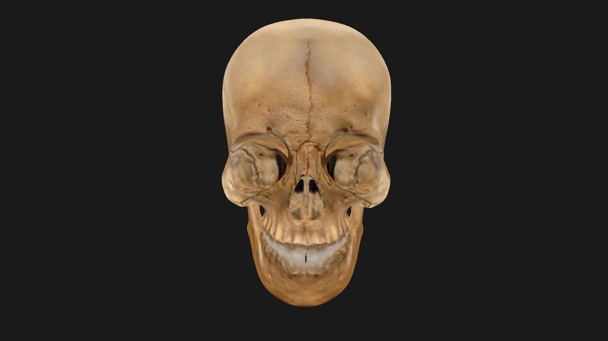
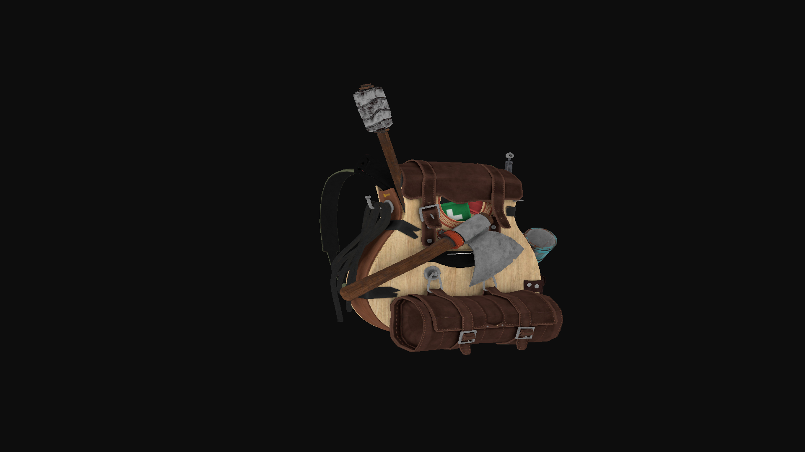

# My C++ OpenGL 3D Model Renderer

Hey! This is a small **3D model renderer** I built with **C++ and OpenGL** just to mess around and really understand how rendering works under the hood. No engines, no magic, just me trying to make some models look cool.

It can load models, apply textures, and move the camera around. Pretty basic but it actually works!

---

## Stuff It Can Do

* Render 3D models with textures
* Uses **Assimp** to load models
* Loads textures with **stb_image**
* Handles shaders (vertex + fragment)
* Move around with a camera
* Clean mesh/model setup

---

## Some Renders

Here are a couple of screenshots of models I rendered:




> Screenshots are in the `docs/` folder.

---

## How My Project Looks

```text
.
├── CMakeLists.txt
├── CMakePresets.json
├── docs/             # Screenshots
├── external/         # GLAD library
├── include/          # GLAD, GLM, stb_image headers
├── res/              # Models and shaders
│   ├── models/
│   └── shaders/
└── src/              # Code
    ├── engine.cpp/h
    ├── main.cpp
    ├── model/        # Meshes and models
    ├── shader/       # Shader stuff
    └── utils/        # Helpers
```

---

## What You Need

* C++17 or newer
* OpenGL 3.3+
* GLFW 3.3+
* Assimp
* GLAD
* GLM
* stb_image

---

## How to Build

```bash
mkdir build
cd build
cmake --preset linux-make
make
```

---

## Run It

```bash
./app
```

Make sure the program can see the `res/` folder with the models and shaders.

---

## Why I Made This

Honestly, just to learn OpenGL better. I wanted to see how vertex data, textures, and shaders all work together, without any engine hiding it. It's simple, fun, and you can play with it if you want.

> **NOTE:** You should have assimp installed
